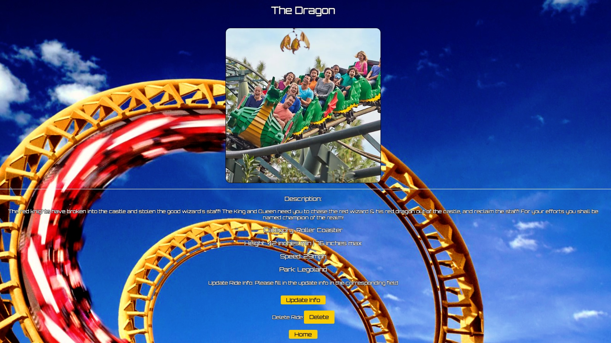
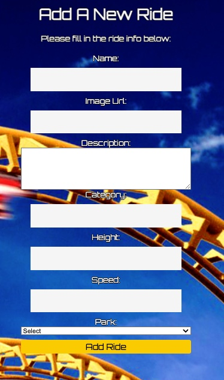

# Thrill Ride Share

## Date 2/21/2023

### By: Anthony Harpestad, Ting Ting Qiu, Josh Jumelet

#### [Anthony's GitHub](https://github.com/Anthony5321) | [Anthony's LinkedIn](https://www.linkedin.com/in/anthony-harpestad-16322a257/) | [Ting Ting's GitHub](https://github.com/ttqiu) | [Ting Ting's LinkedIn](https://www.linkedin.com/in/ting-ting-qiu-062587246/) | [Josh's GitHub](https://github.com/joshjumelet) | [Josh's LinkedIn](https://www.linkedin.com/in/joshua-jumelet/)

---

### **_Description_**

#### Welcome to our theme park and ride database! Our website is designed to help users find information about theme parks and rides from all around the world. Whether you're planning a family vacation or just want to explore the world of amusement parks, our website has everything you need to know.

---

### **_Technologies Used_**

- M.E.R.N (Mongoose | Express | React.js | Node.js)
- MongoDB
- JavaScript | HTML | CSS
- Heroku

---

### **_Getting Started_**

##### Our website is user-friendly and easy to navigate, with a search function that allows users to filter their results based on theme park, rides and other search methods. Our team is dedicated to providing the best possible experience for our users and we're always working to improve our website with new features (listed below). Users can add new theme parks and rides and enter and view specific details once created to keep track of their favorite experiences.

##### A Trello board was used to keep track of development progress and can be viewed [here](https://trello.com/b/pWlPviMB/first-group-project).

##### An ERD and Component Heirarchy Diagram were created for this application.

##### The project itself was deployed and can be viewed [here](https://thrill-ride-share.herokuapp.com/).

---

### **_Screenshots_**

##### Home Page:

##### Park Details:

##### Ride Details:

##### Add a Ride:

---

### **_Future Updates_**

- [x] Most recent added ride featured on home page
- [ ] Implement API feature
- [ ] User comments feature for rides

---

### **_Credits_**

##### Google Image: [Google](https://www.google.com/imghp?hl=en&tab=ri&ogbl)

##### ChatGPT: [Openai](https://chat.openai.com/chat)

##### Stack Overflow: [StackOverflow](https://stackoverflow.com/)

##### CSS Cheatsheet: [CssReference](https://cssreference.io/)

---
